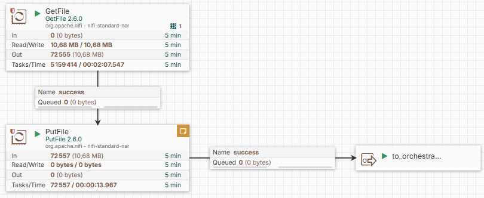
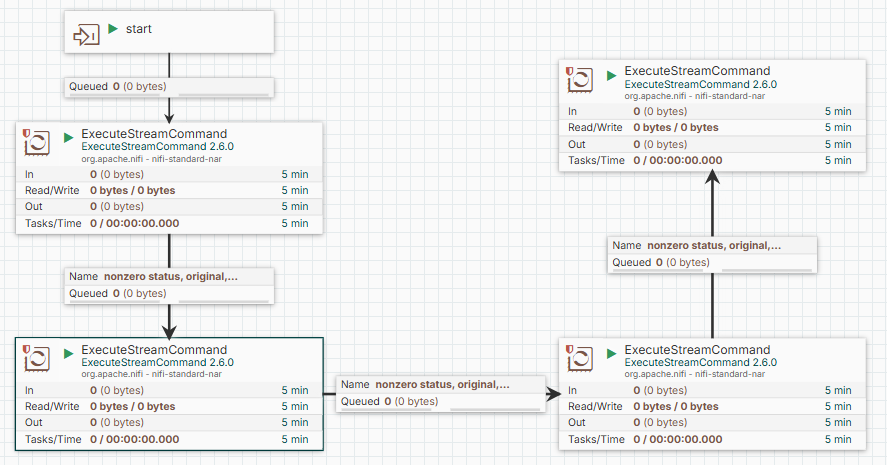

# TV Audience Pipeline — NiFi + dbt + DuckDB

**Mini end-to-end data pipeline** for international TV audiences.  
**NiFi** handles ingestion & orchestration, **dbt + DuckDB** perform SQL transforms & data tests, and the pipeline produces **CSV exports** ready to share.

---

## What this solves
- Automate **file ingestion → transformations → exports** with a clear, visual flow  
- Clean & **deduplicate** audiences (keep latest `loaded_at`)  
- Standardize channels using a **reference table**  
- Produce a **Top 10 programs** KPI by **date** and **country**  
- Enforce **data quality** (dbt tests: `not_null`, `unique`)

---

## Components
- **Apache NiFi** – `GetFile → PutFile → ExecuteStreamCommand(...)`
- **dbt Core + dbt-duckdb** – ELT, tests, model lineage
- **DuckDB** – embedded analytical DB (single `.duckdb` file)
- **Python** – small loaders/exports (Pandas + DuckDB)

---

## Data & Model
Toy but realistic dataset to keep the demo reproducible:
- **Facts**: `audience` (`date, country, channel, program, viewers, loaded_at`)
- **Dim**: `dim_channels` (alias → `channel_std`)
- **Models**
  - `stg_audience` → clean + **ROW_NUMBER** dedupe by `(date, country, channel, program)`
  - `stg_dim_channels` → standardize names
  - `fact_audience` → conformed fact table
  - `kpi_top10` → Top 10 programs per `(date, country)`

---

## Screenshots
### Process Group

### INGESTION

### ORCHESTRATION

